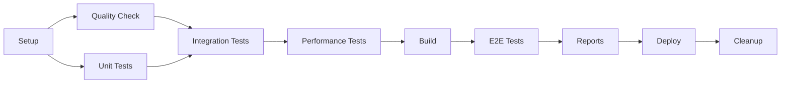

# 🚀 Production-Ready CI/CD Pipeline

## Overview

This repository now includes a comprehensive, production-ready GitHub Actions CI/CD pipeline that implements industry best practices from official documentation sources:

- ✅ **GitHub Actions Best Practices** (2024/2025 official docs)
- ✅ **Grafana K6 + GitHub Actions** (July 2024 official guide)
- ✅ **LocalStack CI/CD Integration** (official LocalStack docs)
- ✅ **Jest Coverage Reporting** (official marketplace action)

## Pipeline Features

### 🔒 Security & Compliance
- Principle of least privilege permissions
- Secret management with environment variables
- Security scanning with npm audit and Trivy
- Dependency vulnerability monitoring

### ⚡ Performance & Efficiency
- Multi-version Node.js matrix builds (18.x, 20.x, 22.x)
- Intelligent caching for dependencies
- Parallel job execution where possible
- Conditional execution based on file changes

### 🧪 Comprehensive Testing
- **Unit Tests**: Jest with coverage reporting
- **Integration Tests**: LocalStack AWS simulation
- **Performance Tests**: K6 load testing
- **End-to-End Tests**: Full workflow validation

### 📊 Monitoring & Reporting
- PR comments with test results and coverage
- Performance metrics and SLO tracking
- Comprehensive artifact collection
- Automated deployment status updates

## Quick Start

### 1. Required Secrets
Add these to your repository secrets:

```bash
# Optional - for LocalStack Pro features
LOCALSTACK_AUTH_TOKEN=your_token_here

# Optional - for enhanced Codecov integration  
CODECOV_TOKEN=your_token_here
```

### 2. Run the Pipeline
The pipeline automatically triggers on:
- Push to `main`, `develop`, `feature/**`, `hotfix/**`
- Pull requests to `main` or `develop`
- Manual workflow dispatch

### 3. Monitor Results
- Check the Actions tab for detailed results
- PR comments show test summaries
- Artifacts contain detailed reports

## Pipeline Structure



## Job Details

| Job | Purpose | Runtime | Dependencies |
|-----|---------|---------|--------------|
| `setup` | Environment configuration | ~1 min | None |
| `quality` | Linting and security audit | ~2 min | setup |
| `unit-tests` | Jest unit tests with coverage | ~3 min | setup |
| `integration-tests` | LocalStack integration tests | ~5 min | unit-tests |
| `performance-tests` | K6 load testing | ~4 min | integration-tests |
| `build` | Application build and packaging | ~2 min | quality |
| `e2e-tests` | End-to-end workflow tests | ~6 min | build |
| `reports` | Aggregate and publish results | ~2 min | All tests |
| `deploy` | Environment deployment | ~3 min | reports |
| `cleanup` | Resource cleanup | ~1 min | Always runs |

## Configuration Files

### Core Pipeline
- `.github/workflows/best-practices-ci-cd.yml` - Main CI/CD pipeline

### Testing Configuration
- `jest.config.js` - Jest configuration
- `eslint.config.js` - ESLint configuration
- `config/k6-config.json` - K6 performance test config
- `config/performance-thresholds.json` - SLO definitions

### Validation
- `scripts/validate-ci-pipeline.js` - Pre-flight validation script

## Environment Variables

### Build Configuration
- `NODE_VERSION` - Node.js version (default: 20.x)
- `BUCKET_NAME` - S3 bucket for testing (default: test-bucket)

### Feature Flags
- `SKIP_PERFORMANCE_TESTS` - Skip performance tests (default: false)
- `SKIP_E2E_TESTS` - Skip E2E tests (default: false)

## Best Practices Implemented

### 🏗️ Architecture
- [x] Modular job structure with clear dependencies
- [x] Matrix builds for multiple Node.js versions
- [x] Conditional execution based on file changes
- [x] Proper artifact management and retention

### 🔐 Security
- [x] Minimal permissions per job
- [x] Secret management best practices
- [x] Security scanning integration
- [x] Dependency vulnerability monitoring

### 🎯 Testing
- [x] Multi-layer test strategy (unit → integration → performance → E2E)
- [x] Official tool integrations (K6, LocalStack, Jest)
- [x] SLO-based pass/fail criteria
- [x] Coverage requirements and reporting

### 📈 Performance
- [x] Intelligent caching strategies
- [x] Parallel execution where beneficial
- [x] Timeout management and resource optimization
- [x] Background process management

## Troubleshooting

### Common Issues

1. **LocalStack timeouts**
   - Check LocalStack logs in artifacts
   - Verify service health endpoints
   - Review service configuration

2. **K6 test failures**
   - Check performance thresholds
   - Review SLO definitions
   - Verify test data and scenarios

3. **Coverage requirements**
   - Review Jest coverage reports
   - Check threshold settings
   - Examine uncovered code paths

### Debug Information
- LocalStack logs are collected in artifacts
- Test results include detailed error messages
- Performance metrics are preserved for analysis

## Migration from Existing Workflows

If you have existing workflows, you can:

1. **Gradual Migration**: Run new pipeline alongside existing ones
2. **Feature Flags**: Use environment variables to control execution
3. **Validation**: Use the validation script to check compatibility

## Contributing

When contributing to the pipeline:

1. Run the validation script locally
2. Test changes with workflow dispatch
3. Monitor performance impact
4. Update documentation as needed

## Support

- Check the validation script output for issues
- Review artifact logs for debugging
- Consult the best practices documentation
- Open issues for pipeline-related problems

---

## 📋 Pipeline Checklist

Before deploying:

- [ ] All required secrets are configured
- [ ] Dependencies are up to date
- [ ] Tests pass locally
- [ ] Performance thresholds are realistic
- [ ] Security scans are clean
- [ ] Documentation is updated

## 🔗 References

- [Pipeline Best Practices Document](./PIPELINE-BEST-PRACTICES.md)
- [GitHub Actions Documentation](https://docs.github.com/en/actions)
- [K6 Performance Testing](https://k6.io/docs/)
- [LocalStack Documentation](https://docs.localstack.cloud/)
- [Jest Testing Framework](https://jestjs.io/)

---

*This pipeline is continuously updated to reflect the latest best practices and tool improvements.*
